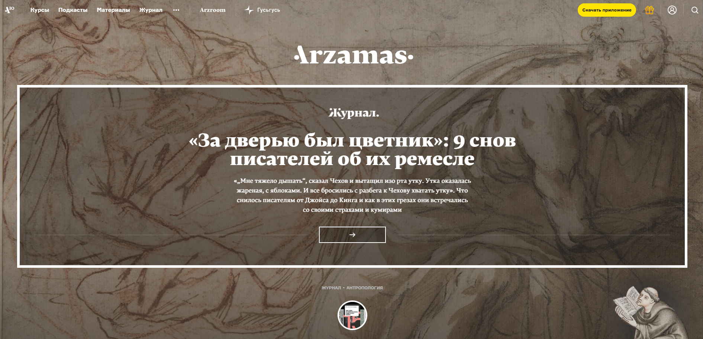
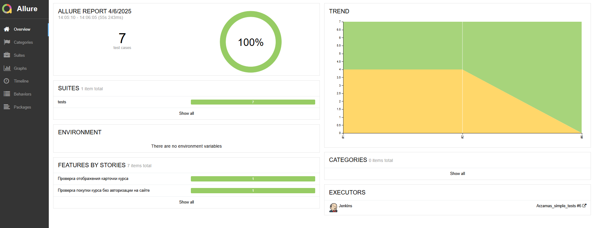
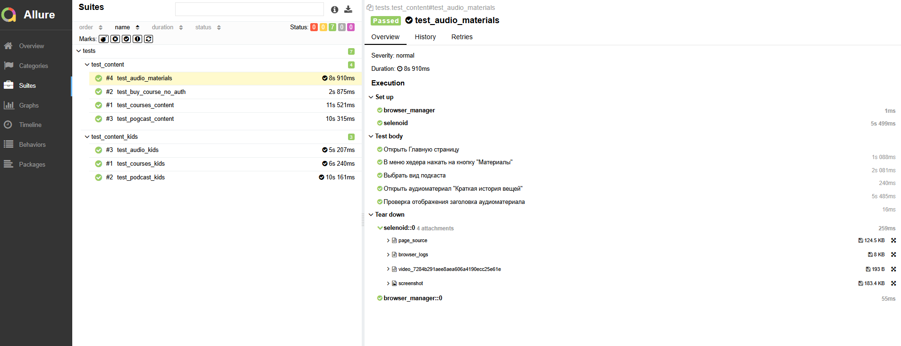
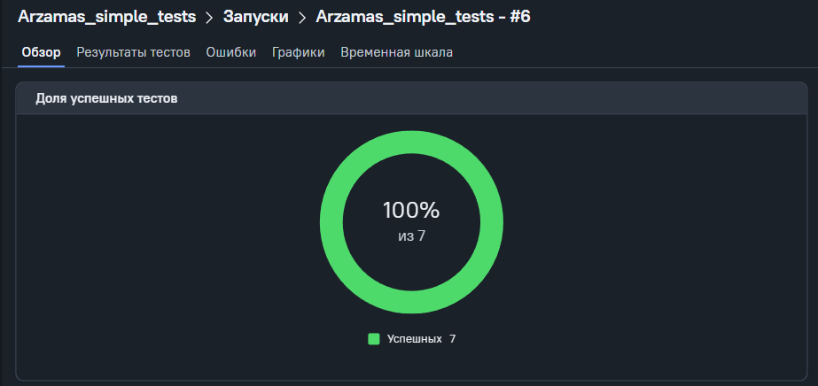
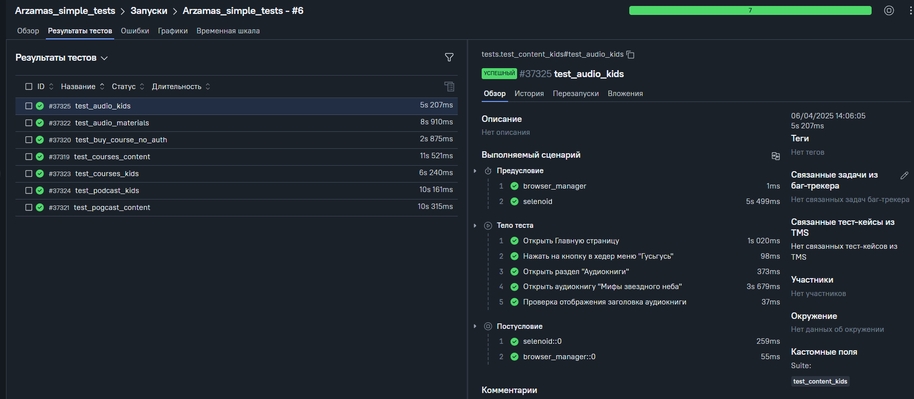
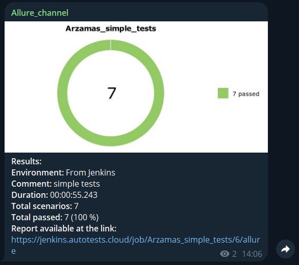

## Простые тесты для сайта Arzamas

[Arzamas](https://arzamas.academy/)

---


---

> ➠ [Список проведенных проверок](#Список-проведенных-проверок)
> 
> ➠ [Стэк](#Проект-реализован-с-использованием-актуальных-инструментов)
>
> ➠ [Локальный запуск](#Локальный-запуск)
>
> ➠ [Удаленный запуск через Jenkins](#Удаленный-запуск-тестов-выполняется-в-Jenkins)
> 
> ➠ [Статистика отчета в Allure TestOps](#Статистика-отчета-хранится-в-Allure-TestOps)
> 
> ➠ [Отчет в Telegram](#Отчет-о-результатах-тестирования-в-Telegram)
---


## Список проведенных проверок:
- Отображение карточек курсов, подкастов и аудиоматериалов в разделе Арзамас
- Отображение карточек курсов, подкастов и аудиоматериалов в разделе Гусьгусь
- Работа поиска

---

## Проект реализован с использованием актуальных инструментов:  
           

- Язык программирования `Python`
- Фреймворк для написания UI тестов `Selene` с использованием `Selenium WebDriver`
- Фреймворк модульного тестирования `Pytest`
- Выполнение удаленного запуска тестов с помощью `Jenkins` с использованием `Selenoid`
- Фреймворки для сбора отчетности и хранения файлов тестирования `Allure Report`
- Инструмент для сбора и хранения статистики тестов `Allure TestOps`
- Краткие отчеты в `Telegram` отправляет `Telegram Bot`

---

## Локальный запуск
Перед запуском в корне проекта создать файл .env с содержимым:
```
SELENOID_LOGIN=your_login
SELENOID_PASS=your_password
SELENOID_URL=selenoid.autotests.cloud
```

Для локального запуска необходимо выполнить:
```
python -m venv .venv
source .venv/bin/activate
pip install -r requirements.txt
pytest .
```

---
## Удаленный запуск тестов выполняется в Jenkins
Посмотреть и запустить можно на странице проекта в [Jenkins](https://jenkins.autotests.cloud/job/Arzamas_simple_tests/).

Для запуска тестов необходимо:
1. Перейти на [проект](https://jenkins.autotests.cloud/job/Arzamas_simple_tests/)
2. Нажать на кнопку `Build now`
3. Дождаться окончания тестирования
4. Нажать на кнопку `Allure Report` 

Откроется страница отчета



Детальная информация с шагами и аттачментами отображается в разделе `Suites`



---
### Статистика отчета хранится в Allure TestOps
Последний отчет можно посмотреть на сайте [Allure TestOps](https://allure.autotests.cloud/launch/45643/?treeId=0)  
Для просмотра статистики после запуска в Jenkins в шаге 4 необходимо нажать на кнопку `Allure TestOps` 



Детальная информация по тест-кейсам




---
### Отчет о результатах тестирования в Telegram
Отчеты приходят в канал [Allure_channel](https://t.me/Allure_channel_autotests)




